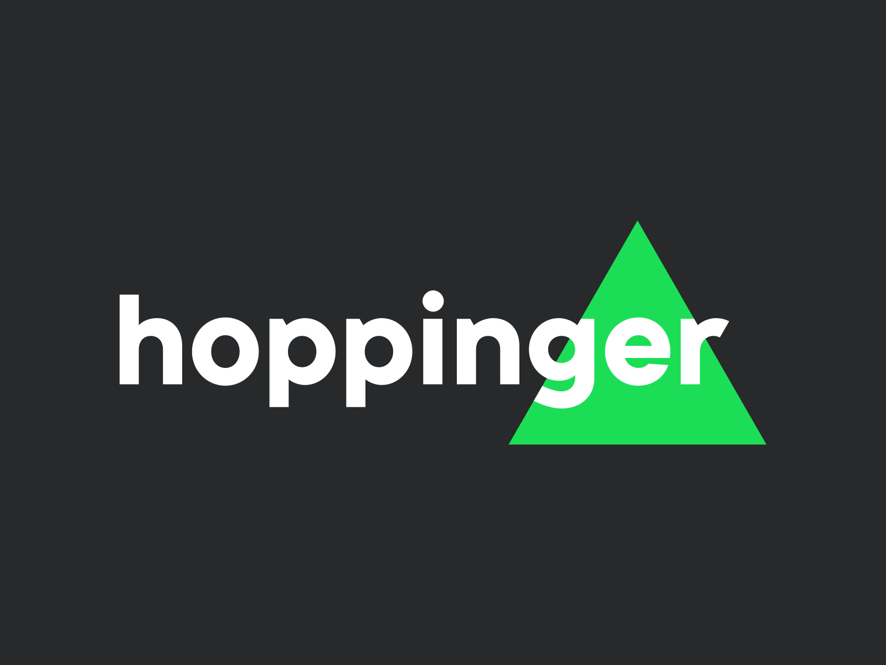

# Ballerina 🩰

Welcome to _ballerina_, the effortlessly elegant functional programming framework for frontend web development, with a particular but non-exclusive preference for React.

With special thanks to BLP Digital, where Ballerina has been built:


## The challenge
Ballerina is an advanced professional tool for advanced professionals. She is your best ally when you need to build something big and complex, and thanks to her grace and ability she will help you turn this complexity into elegant code.

Ballerina integrates the state of the art in functional programming and even category theory. She is great at these things, so that you don't necessarily need to be. You can just dance with her, and her skills will augment yours and make your work elegant and effective. And if you are a master of functional programming, together you will write code that can be, well, transcendental.

Here is my favorite snippet of code showcasing a timed animation that showcases a timed process with real-clock waiting operations:

```ts
export const Child2Animation = 
  Co.Repeat(
    Co.Seq([
      Co.SetState(Child2.Updaters.Core.a(replaceWith(1)).then(
        Child2.Updaters.Core.b(replaceWith("")))),
      Co.Wait(250),
      Co.For(Range(0, 3))(
        _ =>
          Co.Seq([
            Co.SetState(Child2.Updaters.Core.a(_ => _ * 2)),
            Co.Wait(250),
            Co.SetState(Child2.Updaters.Core.b(_ => _ + ".")),
            Co.Wait(250),
          ])
      )
    ])
  );
```

Not only is the code pretty self explanatory, but the alternative implementation of state machines in any frontend framework would look terrible, easily be unmaintainable, and lose all the advantages of scoping, nesting, clear sequencing and parallelism as offered by coroutines, and much more.

And this doesn't even showcase the advanced operators `Co.Any`, `Co.All`, `Co.Await`, or `Co.Embed`...

If you want an extensive introduction to everything you can do with Ballerina, take a look at the [guidelines](./guidelines.md).

> You might have heard about the _hello world syndrome_, the terrible sickness that tool makers exploit to show off how their simple libraries make simple tasks simpler, without saying anything about what they do to complex tasks - because the truth is that simple libraries are irrelevant in the grand scheme of things.


## Quick overview
Ballerina features tools that help you split up your code into _domains_, both horizontally and hierarchically. This way you can split your application into epics (horizontal split) which are neatly decomposed into smaller pieces (hierarchical split).

For example:

```
domains
│
└─parent
│ │
│ └─child1
│ │
│ └─child2
│
└─uncle
```

Ballerina then helps you partition each subdomain into state, state updaters, asynchronous background operations, APIs, and views with a series of idioms and supporting libraries based on the state of the art in category theory and functional programming.

Ballerina views are currently based on React, but the library is completely framework (and meta-framework) agnostic. Ballerina is light and flexible, and she can work well in any stage: Vue, Angular, jQuery, you name it, she will bring her grace anywhere you want.


## Playground
Head over to the [Playground](./frontend/playground) and start checking out the extensive code of the sample application.

Launch the whole thing [with a single command](./frontend/startup.sh) and head over to [localhost:8081](http://localhost:8081/).

Check out the [main.tsx](./frontend/playground/main.tsx) and [App.tsx](./frontend/playground/src/App.tsx) entry points, and then take the plunge into the [various](./frontend/playground/src/domains/parent) [domains](./frontend/playground/src/domains/uncle/) and [also the](./frontend/playground/src/domains/parent/domains/child1/) [subdomains](./frontend/playground/src/domains/parent/domains/child2/).

Create a new domain by running:

```
yarn create-domain --name child3 --path ./src/domains/parent/domains
```

and check out the structure it creates for you. Try adding the `child3` subdomain to the [state of the parent](./frontend/playground/src/domains/parent/state.ts) and to render it from the [view of the parent](./frontend/playground/src/domains/parent/views/). Be curious, experiment, and most of all: enjoy! 


## Getting started
Coming soon: npm packages.


## Modifying the core
You are free to adapt the core for whatever purpose you have in mind. Just head over to the [core folder](./frontend/core/) and don't forget to run the [core-startup.sh script](./frontend/core-startup.sh). Remember that the playground uses `npm link` to use the core as a dependency, so make sure to regularly re-run `npm link ../core` from the [playground folder](./frontend/playground/) so that any changes you make to the core are immediately visible from the playground.


### Learning more about the foundations
You might want to check out some resources in order to discover something about the theoretical foundations of Ballerina. If that's the case, we've got you covered! Here are a load of videos from the same author(s) of the framework:

- a [quick React primer](https://youtube.com/playlist?list=PL-yGOsK2iEWgC7tWMGW9kSsV35Y9mXB9Q&si=VpezYzijglPcmZFp) might give you some insights on how to interpret React a bit differently than is usually done.
- if you need, [brush up your Typescript](https://youtube.com/playlist?list=PL-yGOsK2iEWhl6QQBqKRHgUlidZjqWkSX&si=DAjgv3JRASkkkQbK) a bit, it will come in handy.
- finally, [learn advanced functional programming and category theory in Typescript and React](https://youtube.com/playlist?list=PL-yGOsK2iEWgzcbvRRjkwznITX5iTkyeH&si=cXuyCDaACsmiYR-j) to see the whole picture.


And something from the brilliant, ballerina-unrelated, Bartosw Milewski: his amazing [course on Category Theory for programmers](https://youtu.be/I8LbkfSSR58?si=zPscCamuxs8TdKbx).


## About the main author
I am Giuseppe. I started programming as a teenager, ruinously attempting to build videogames in C++ and DirectX. I did not manage, but I ended up discovering algorithms, linear algebra, complexity, as well as memory leaks and spaghetti code.

This made me realize that maybe, just maybe, I was not going to manage to learn all of this on my own, and that maybe, just maybe, learning from the masters was a humbling but necessary experience. And that I did! I acquired a BSc, then an MSc, and finally why not! Also a PhD in Computer Science at the University of Venice.

During my studies I discovered functional programming, and how code does not need to be broken and miserable all the time. And for a while, that was it.

I started teaching in the Netherlands, at RUAS in Rotterdam, where I kinda quickly became an Associate Professor (best translation I can think of for the word _hoofddocent_). Teaching is one of my passions, but I also like to build stuff, so I became CTO of Hoppinger in Rotterdam/Amsterdam, building web apps. CTOing is one of my passions, but I also like to build complex stuff, so I also became Senior Architect at BLP in Zurich, building a mega complicated SaaS app with machine learning and super big multi-tenant integrations with ERPs all over Europe.

During my career, I always tried to keep things in balance: code can be beautiful and elegant (Ballerina!!!) but at some point the software needs to be shipped with happy clients and happy business, buuuuuuut three years from now the code needs to still be as elegant and clean as when ti was shipped the first time because otherwise you die from the weight of your technical debt.


## Powered by
This open source repository has been entirely built during my tenure at BLP, together with BLP' amazing frontend team. A very heartfelt shout out goes to the brilliant David and Konrad: without you guys Ballerina would not exist. Have some ballerina shoes as a token of my appreciation: 🩰 and 🩰.


## Special thanks
BLP is the only contributor and sponsor of the Ballerina framework, but it would be unfair to not mention that Ballerina stands on the shoulders of giants. One giant in particular is Hoppinger, where the previous iterations of React wrappers and coroutines have been extensively studied and played with:



A lot of little thankful ballerina shoes and hearts go to 🩰 Francesco ❤️, 🩰 Lucas ❤️, and 🩰 Marielle ❤️, as well as countless others who provided the critique and inspirations that gave me the knowledge to eventually build Ballerina at BLP. I would not be where I am without you.
 